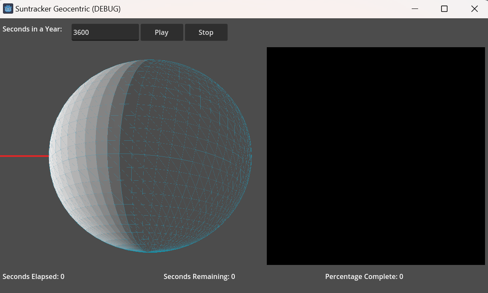

# Suntracker Geocentric

Tracks the focal point of the sun on a globe and maps it to a 2d plane. Or in other words maps the sun's movement on celestial globe to the terrestrial plane. 

## TODO
- Make the main converter that translates a point on the globe to a point on the map. 
- Efficiently write it to the Texture2d without slowing the simulation. 

